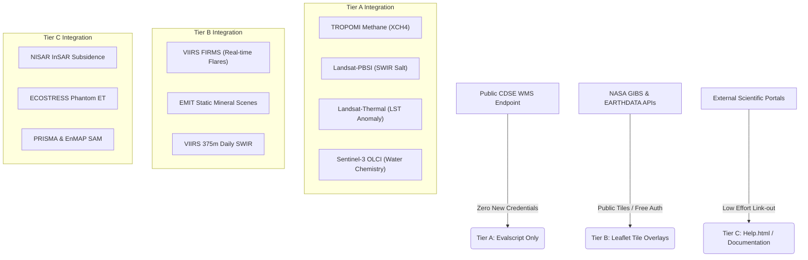

# Satellite Sensor Platforms Reference

This document serves as the unified, authoritative guide to the 31 open-access and free satellite platforms suitable for remote sensing research, environmental screening, and spectral index development.

---

## The Open Sensor Ecosystem

Modern remote sensing has evolved beyond traditional multi-spectral boundaries. The current public sensor stack provides five distinct detection dimensions:
1. **Surface Geochemistry**: Hyperspectral imaging spectrometers (EMIT, EnMAP, PRISMA, PACE) resolving mineral, soil, hydrocarbon, and algal chemistry.
2. **Surface Deformation**: Active radar (Sentinel-1, future NISAR) and lidar (ICESat-2) providing mm-scale ground movement and elevation tracking.
3. **Thermal Inertia & Evapotranspiration**: Diurnal thermal infrared sensors (ECOSTRESS, Landsat TIRS, ASTER) mapping heat anomalies, soil saturation, and canopy water stress.
4. **Atmospheric Columns**: Atmospheric sounders (TROPOMI, IASI) quantifying methane plumes, SO2 flaring, and urban NO2 concentrations.
5. **Basin Hydrology**: Microwave gravity anomalies (GRACE-FO) measuring groundwater storage depletion.

---

## Prioritized Platform Rankings

Platforms are ranked by their composite **Public Benefit Score (out of 40)**, reflecting: spectral specificity, revisit frequency, spatial resolution, and policy-actionable utility.

| Rank | Platform | Score | Primary Role in Environmental Triage |
|:---:|---|:---:|---|
| **1** | **EMIT** | 37/40 | Forensic mapping of persistent brine mineral scars (gypsum, halite) and hydrocarbon stains. |
| **2** | **NISAR** | 36/40 | Upcoming global L-band InSAR; critical for injection-well subsidence and dielectric soil moisture. |
| **2** | **Sentinel-5P TROPOMI** | 36/40 | Daily global column methane (XCH4), NO2, and combustion flare efficiency screening. |
| **4** | **EnMAP** | 35/40 | Systematic 30m environmental hyperspectral; outstanding SWIR mineral resolving power. |
| **5** | **PRISMA** | 33/40 | High-quality 30m hyperspectral research sensor (ASI Italy); excellent mineral library matching. |
| **6** | **Sentinel-1 InSAR** | 33/40 | Free, systematic C-band radar; persistent scatterer subsidence time series from 2014. |
| **7** | **GRACE-FO** | 32/40 | Basin-scale gravity anomalies; independent validation of deep well injection fluid mass balance. |
| **8** | **AVIRIS-NG** | 32/40 | Airborne campaign spectrometer; the scientific gold standard for local calibration and validation. |
| **9** | **ECOSTRESS** | 31/40 | ISS diurnal thermal; computes thermal inertia and out-of-phase "phantom ET" in brine pools. |
| **10** | **Landsat 8/9 OLI/TIRS** | 29/40 | 40-year multi-spectral, SWIR, and thermal continuity; essential for chronological timeline audits. |
| **10** | **ASTER TIR** | 29/40 | Emissivity spectroscopy resolving surface gypsum precipitation via 5 thermal bands. |
| **10** | **ICESat-2** | 29/40 | Lidar profiling; 1 cm vertical resolution subsidence cross-sections. |
| **13** | **GOES-16/18 ABI** | 28/40 | 5-minute geostationary cadence; real-time gas flaring and wildfire monitoring. |
| **14** | **IASI (Metop)** | 29/40 | Column ammonia (NH3) outgassing from produced water impoundments. |
| **15** | **ALOS-2 (JAXA)** | 27/40 | L-band InSAR; proposal-based research access. |
| **16** | **OCO-2/3** | 27/40 | CO2 point-source column anomalies and solar-induced fluorescence (SIF). |
| **17** | **VIIRS** | 26/40 | Daily 375m SWIR and active fire radiative power (FRP) tracking. |
| **18** | **TanDEM-X** | 26/40 | High-resolution baseline DEM differencing for slumps, landslides, and subsidence. |
| **19** | **GOSAT** | 25/40 | Historical 15-year greenhouse gas baseline. |
| **20** | **Planet Dove** | 25/40 | High-resolution 3m daily imaging (academic/non-commercial access limits). |
| **21-31** | **Supplemental** | 15-24 | Includes Sentinel-3 OLCI, PACE OCI, SMAP, SMOS, DESIS, HISUI, and CopDEM. |

---

## Detailed Platform Guides

### 1. The Hyperspectral Frontrunner: EMIT
*   **Agency**: NASA JPL
*   **Resolution**: 60 m spatial | 285 spectral channels (380–2500 nm, 7.4 nm resolution)
*   **Orbits**: ISS Opportunistic overpass
*   **Geochemical Targets**: 
    *   *Sulfate altered soils (gypsum)*: Diagnostic SWIR absorption features at 2160 nm and 2211 nm.
    *   *Chloride salt crusts (halite)*: Visible spectral slope changes and overtone depressions.
    *   *Anoxic iron stains (goethite/hematite)*: Visible absorption peaks at 480 nm and 900 nm.
    *   *Clay structural changes*: Cation exchange signals in Al-OH (2200 nm), Mg-OH (2310 nm), and Fe-OH (2250 nm) bands.
    *   *Oily residue*: Aliphatic C-H stretch absorption features at 1700–1730 nm and 2300–2350 nm.
*   **Key Advantage**: Geochemical scars survive on the land surface long after the liquid water of a brine spill has evaporated. EMIT provides the first systematic way to map these persistent forensic signatures from orbit.
*   **Access Path**: LP DAAC via `search.earthdata.nasa.gov` (EMIT L2B Mineralogy product).

### 2. The Atmospheric Column Standard: TROPOMI
*   **Agency**: ESA (Sentinel-5P)
*   **Resolution**: 3.5 × 5.5 km spatial | Daily global coverage
*   **Target Species**: 
    *   *Methane (XCH4)*: Measured in the SWIR window (2305–2385 nm); resolves massive point-source emitters and basin-wide outgassing.
    *   *Nitrogen Dioxide (NO2)*: UV-VIS columns indicating diesel combustion load, heavy traffic, and industrial centers.
    *   *Sulfur Dioxide (SO2) & Carbon Monoxide (CO)*: Flags flare combustion efficiency anomalies.
*   **Access Path**: Copernicus Data Space Ecosystem (CDSE).

### 3. The Future Structural Standard: NISAR
*   **Agency**: NASA / ISRO
*   **Resolution**: 3–10 m spatial | 12-day repeat orbit
*   **Bands**: L-band (24 cm wavelength) and S-band (12 cm wavelength) dual SAR
*   **Geotechnical Targets**:
    *   *Subsurface moisture*: L-band penetrates 5–20 cm of dry soil, detecting subsurface brine anomalies based on its highly elevated dielectric constant.
    *   *Millimeter-scale ground deformation*: Direct tracking of surface subsidence over deep water injection wells via InSAR.
*   **Status**: Launched; data integration expected 2025–2026.

### 4. Diurnal Thermal Specialist: ECOSTRESS
*   **Agency**: NASA JPL
*   **Resolution**: 70 × 38 m spatial | Diurnal variable overpass
*   **Bands**: 5 thermal infrared bands (8–12 µm)
*   **Hydrological Targets**:
    *   *Phantom ET*: Evaporating brine impoundments produce high water-loss signals that fail to correlate with vegetation indices.
    *   *Sub-lethal vegetative injury*: Detects canopy temperature anomalies (due to shut-down stomatal cooling) before cellular chlorosis occurs.
*   **Access Path**: `search.earthdata.nasa.gov`.

---

## App Integration Roadmap

To translate sensor capabilities into actionable public-good screening, a tiered developer integration path is mapped:

### Tier A: Same WMS Endpoint (Zero New APIs)
These layers utilize the existing Copernicus Data Space Ecosystem (CDSE) credentials and WMS endpoints. They require only writing a custom Javascript Evalscript to render the custom composite:
*   **Sentinel-5P TROPOMI Methane & SO2**: Renders daily greenhouse gas plumes at 3.5 km scale.
*   **Landsat 8/9 PBSI (SWIR Salt)**: `(SWIR2 - SWIR1)/(SWIR2 + SWIR1) - NDVI` bare-soil salt crust monitor.
*   **Landsat 8/9 Thermal Anomaly**: Diurnal surface temperature deviation from seasonal baseline.
*   **Sentinel-3 OLCI Water Color**: `(B04 / B03) * (B08 / B06)` produced water chemistry screening at 300 m.

### Tier B: New API, High Public Value (Free Auth)
These layers ingest data from NASA GIBS or Earthdata Search:
*   **VIIRS FIRMS Active Flares**: Direct integration of NASA's Fire Information for Resource Management System (FIRMS) Web Map Service (WMS) as a Leaflet overlay.
*   **EMIT Geochemical alteration**: Loads processed static GeoTIFF scenes over the Permian Basin to allow users to screen historical brine-impacted soils.

### Tier C: Documentation & External Links
For highly complex or computationally intensive data (such as multi-temporal InSAR processing, gravity hydrology, or high-dimensional spectral angle mapping), the platform details, formulas, and portal access instructions are documented in the application's `help.html`, providing users a direct link-out to execute the workflow:
*   **Sentinel-1 PS-InSAR (ASF Vertex)**: Subsidence rate tracking.
*   **ECOSTRESS PW-ETA (LP DAAC)**: Diurnal evapotranspiration anomalies.
*   **GRACE-FO PWI (NASA Earthdata)**: Basin-wide fluid mass balance tracking.
